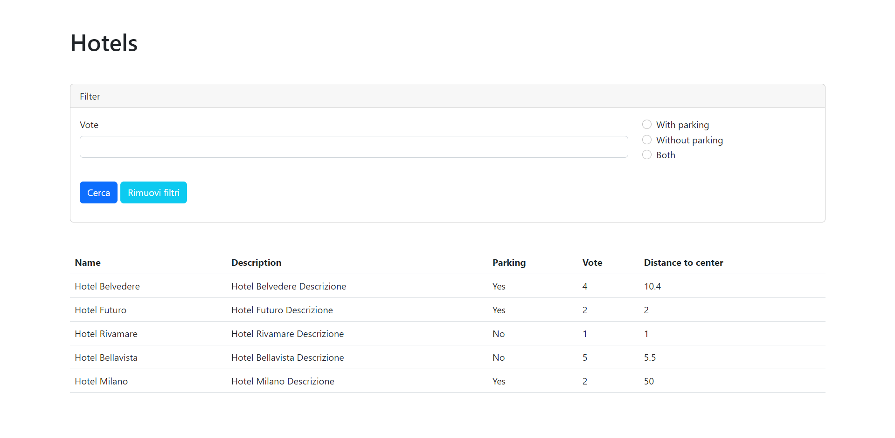

# PHP HOTEL

;

## DESCRIZIONE

- Partiamo da questo array di hotel. https://www.codepile.net/pile/OEWY7Q1G
- Stampare tutti i nostri hotel con tutti i dati disponibili.

## SVOLGIMENTO:

- Stampare in pagina i dati, senza lo stile.

- Aggiungere Bootstrap e mostrare le informazioni con una tabella.

## Bonus:

1. Aggiungere un form ad inizio pagina che tramite una richiesta GET permetta di filtrare gli hotel che hanno un parcheggio.
;
<!-- 2. Aggiungere un secondo campo al form che permetta di filtrare gli hotel per voto (es. inserisco 3 ed ottengo tutti gli hotel che hanno un voto di tre stelle o superiore)
   NOTA: deve essere possibile utilizzare entrambi i filtri contemporaneamente (es. ottenere una lista con hotel che dispongono di parcheggio e che hanno un voto di tre stelle o superiore)

_Se non viene specificato nessun filtro, visualizzare come in precedenza tutti gli hotel._ -->
